# Markdown Tutorial

This is a tutorial on how to make markdown files. No prior knowledge in programming is required.

# Table of Contents

- [What is a markdown file?](#what-is-a-markdown-file)
- [Prerequisite](#prerequisite)
- [Italic](#italic)
- [Bold](#bold)
- [Headers](#headers)
- [Links](#links)
- [Links (Relative)](#links-relative)
- [Links (Section)](#links-section)
- [Images](#images)
- [Blockquotes](#blockquotes)
- [Unordered List](#unordered-list)
- [Ordered List](#ordered-list)
- [Task List](#task-list)
- [Paragraph (soft break)](#paragraph-soft-break)
- [Subscript](#subscript)
- [Superscript](#superscript)
- [Code (inline)](#code-inline)
- [Code (block)](#code-block)
- [Math Equation (inline)](#math-equation-inline)
- [Math Equation (block)](#math-equation-block)
- [Tables](#tables)
- [Tips](#tips)

## What is a markdown file?

- It has an extension of `.md`.
- A way to write content for the web.
- Has wide range of compatibility. Unlike cumbersome word processing applications, text written in Markdown can be easily shared between computers, mobile phones, and people.
- It’s quickly becoming the writing standard for academics, scientists, writers, and many more.
- Markdown focuses on the content rather than the style. It doesn’t do anything fancy like change the font size, color, or type. All we have control over is the structure of the text - creating headers, organizing lists, giving emphasis etc.
- Source: [https://www.markdowntutorial.com/](https://www.markdowntutorial.com/)
- Personal reasons why I prefer markdown files:
  - It is lightweight.
  - No annoying page breaks.
  - Has cleaner look.
  - Makes the structure more obvious.
  - No worries in spacing.

## Prerequisite

1. Install [Visual Studio Code](https://code.visualstudio.com/).
2. Install and configure VS Code extension prettier.
   1. Click the extension toolbar on the right. Search for `prettier` and install it.
      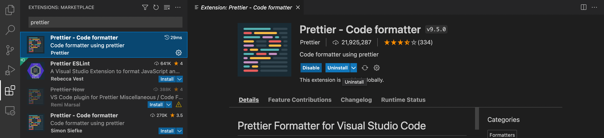
   2. Click the settings toolbar on the right. Search for `Format on Save`. Check format on save.
      
      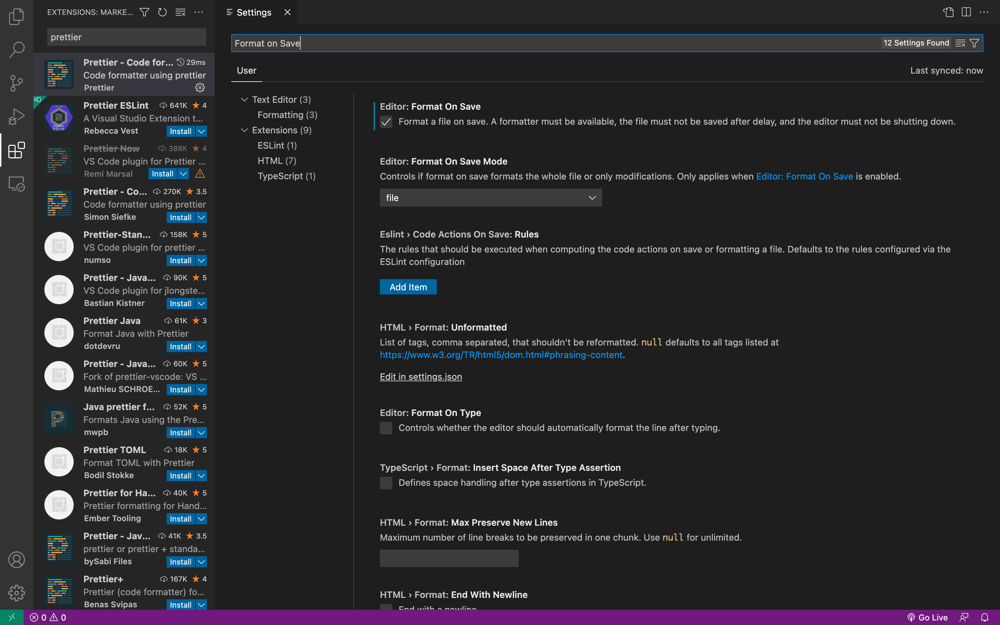
      
   3. Be sure that prettier is enabled. Restart of VS code may be needed.
      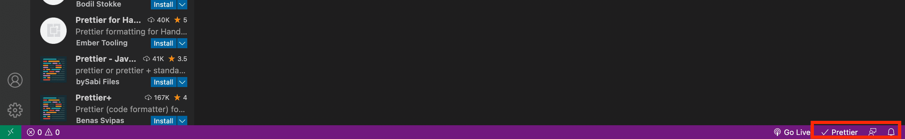
3. (Optional) Create a [github](https://github.com/) account.

## Italic

```
_italic_
```

<details>
<summary><b>Example</b></summary>
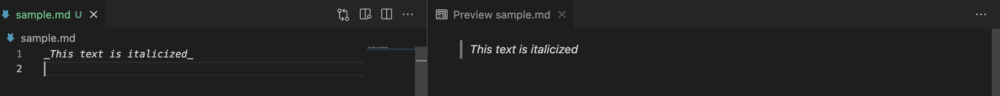
</details>

## Bold

```
**bold**
```

<details>
<summary><b>Example</b></summary>
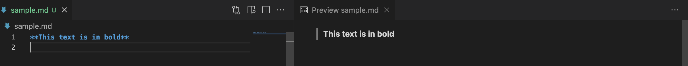
</details>

## Headers

```
# Header 1
## Header 2
### Header 3
#### Header 4
##### Header 5
###### Header 6
```

<details>
<summary><b>Example</b></summary>
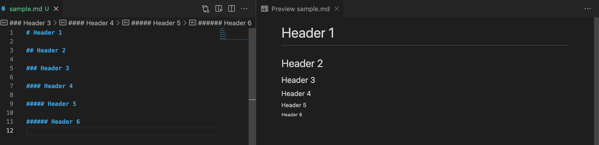
</details>

## Links

```
[text](url)
```

<details>
<summary><b>Example</b></summary>
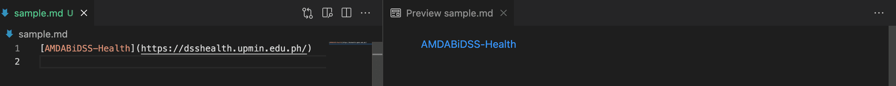
</details>

## Links (Relative)

```
[text](directory)
```

<details>
<summary><b>Example</b></summary>
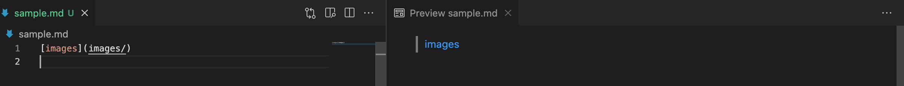
</details>

## Links (Section)

```
[text](#section-heading)
```

Note: Remove special characters

<details>
<summary><b>Example</b></summary>
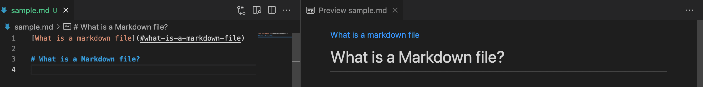
</details>

## Images

```

```

<details>
<summary><b>Example</b></summary>
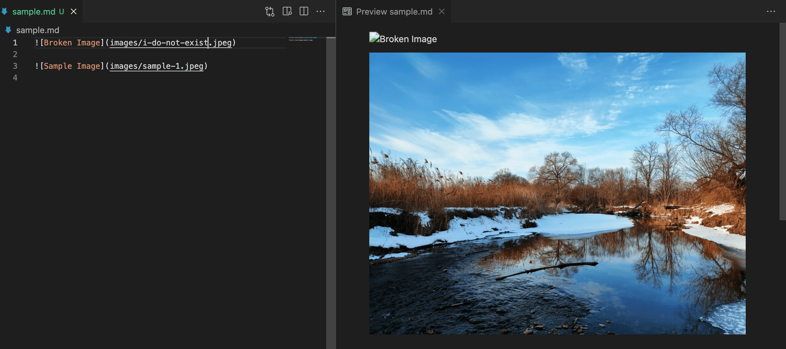
</details>

Note: .gif also works

## Blockquotes

```
> your-quote
```

<details>
<summary><b>Example</b></summary>
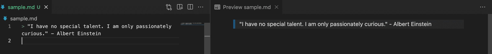
</details>

## Unordered List

```
- Level 1
  - Level 2
    - Level 3
      - Level 4
- Level 1
- Level 1
```

```
- Level 1
  - Level 2
    - Level 3
      - SLevel4
- Level 1
- Level 1
```

<details>
<summary><b>Example</b></summary>
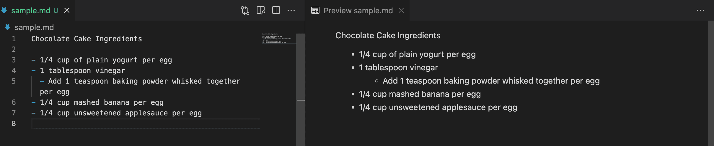
</details>

## Ordered List

```
1. Level 1
   1. Level 2
      1. Level 3
         1. Level 4
1. Level 2
1. Level 4
```

<details>
<summary><b>Example</b></summary>

</details>

## Task List

```
- [x] List-1
- [ ] List-2
- [ ] List-3
```

<details>
<summary><b>Example</b></summary>
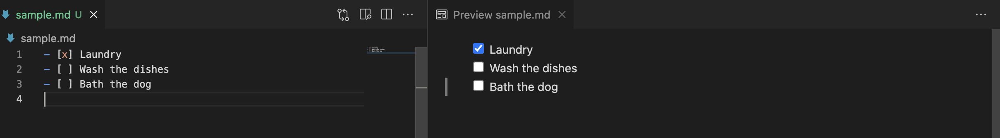
</details>

## Paragraph (soft break)

```
Do I contradict myself?
Very well then I contradict myself
(I am large, I contain multitudes.)
```

Note: Each \* represents a space in keyboard

<details>
<summary><b>Example</b></summary>

</details>

## Subscript

```
<sub>subscript</sub>
```

<details>
<summary><b>Example</b></summary>
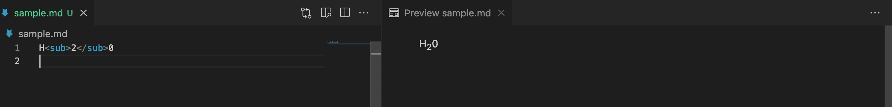
</details>

## Superscript

```
<sup>subscript</sup>
```

<details>
<summary><b>Example</b></summary>
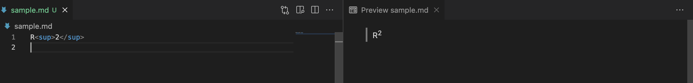
</details>

## Code (inline)

```
`inline-code`
```

<details>
<summary><b>Example</b></summary>
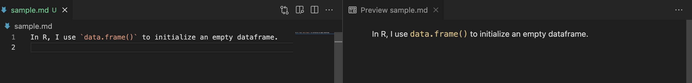
</details>

## Code (block)

````
```
Block code
```
````

<details>
<summary><b>Example</b></summary>
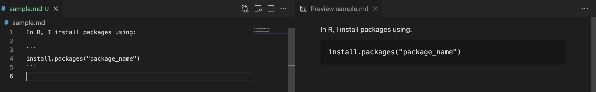
</details>

## Math equation (inline)

```
$ inline-equation $
```

Use: [https://www.tutorialspoint.com/latex_equation_editor](https://www.tutorialspoint.com/latex_equation_editor.htm)

<details>
<summary><b>Example</b></summary>
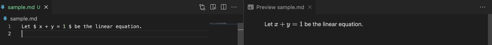
</details>

## Math equation (block)

```
$$ block-equation $$
```

Use: [https://www.tutorialspoint.com/latex_equation_editor](https://www.tutorialspoint.com/latex_equation_editor.htm)

<details>
<summary><b>Example</b></summary>
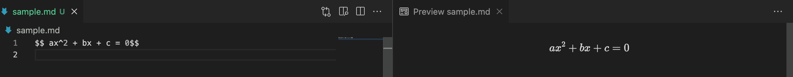
</details>

## Tables

```
| Heading1 | Heading2 | Heading2 |
| -------- | -------- | -------- |
| Data     | Data     | Data     |
| Data     | Data     | Data     |
| Data     | Data     | Data     |
```

<details>
<summary><b>Example</b></summary>
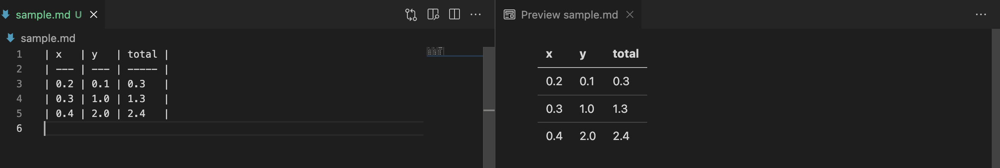
</details>

## Tips

1. Do not use spaces in folder names. Also, use only small caps.
2. Example of tutorials made using markdown files:

- [JavaScript Info](https://github.com/javascript-tutorial/en.javascript.info)
