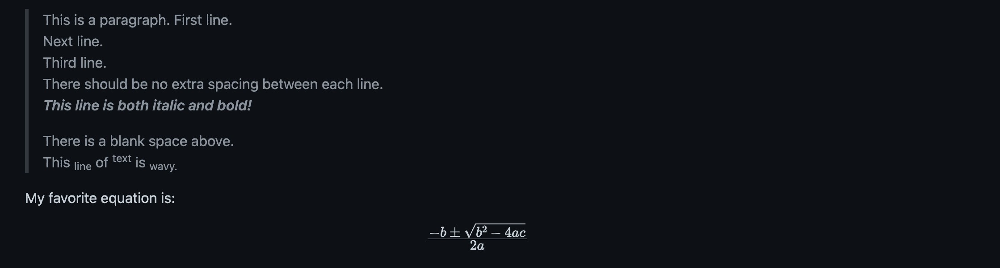

# Exercises

## Part 1

Make a markdown file of the following tutorial: [HPC Logging in](https://asti.dost.gov.ph/coare/wiki/Main/using-coare/hpc/logging-in)

Additional notes:

- No hot linking. Download the assets (images, etc.) locally. Save them inside the images folder.
- Make sure to use sensible filenames to the images.
- Give alt text to images.
- Include a table of contents.

## Part 2

Recreate the following:



## Part 3

Create a task list showing that you accomplished this exercise.
Link by reference your solutions for each task. Also, place your names below the file. Your names should be a link that when clicked, will redirect you to your email. Sample: [Imari Joy C. Borda](mailto:icborda@up.edu.ph)

## Useful Resources:

- [Indenting code blocks](https://www.jetbrains.com/help/hub/Markdown-Syntax.html#indented-code-blocks)
- [Escaping special characters](https://www.jetbrains.com/help/hub/Markdown-Syntax.html#backslash-escapes)
- [Mail to links](https://www.w3schools.io/file/markdown-links/#mailto-links-in-markdown)

## Finish Products (screenhots)

- [Part 1](https://raw.githubusercontent.com/ijborda/markdown-tutorial/main/images/part-1.png)
- [Part 2](https://raw.githubusercontent.com/ijborda/markdown-tutorial/main/images/part-2.png)
- [Part 3](https://raw.githubusercontent.com/ijborda/markdown-tutorial/main/images/part-3.png)

## Solutions

- [Part 1](solution/part-1.md)
- [Part 2](solution/part-2.md)
- [Part 3](solution/part-3.md)

## How to submit

1. Fork and clone this repo
2. Create a new branch called answer
3. Checkout answer branch
4. Create a folder inside `exercise/` called `solution`. Put all your answers there.
5. Push to your fork
6. Issue a pull request
7. Your pull request description should contain the following:
   - (0 to 3) I/We completed the exercises
   - (1 to 5) I/We feel good about our output
   - Anything you want to say!

Example:

```
We completed the exercises: 3
We completed the exercises: 4
My math equations are not rendering properly.
```
